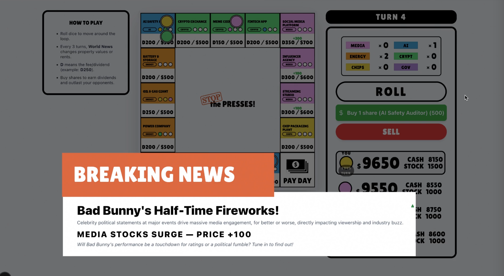

# STOP the PRESSES!



STOP the PRESSES! is an AI‑native, news‑driven stock market board game. Real headlines are classified by an LLM and converted into market events that move dividends and share prices across six sectors. Players buy shares, collect payouts, and try to survive market chaos until a winner is decided.

## Game Summary
- Players: Human + 3 CPUs
- Board: 16 tiles (companies/sectors)
- News: Every turn, real news triggers market effects
- Win condition: Last survivor, or highest net worth at turn 15

## Hackathon
This project was built for the **Global AI Game Hack** (Supercell AI).  
We participated **on‑site in Tokyo**.  
Team name: **NAKAYOSHI**.

## Team Members (X)
- @hayakawagomi
- @sald_ra
- @yasun_ai

Event details:
- Dates: February 6–8 (review until February 9)
- Location: Online + Supercell offices (Tokyo, London, Helsinki, San Francisco)
- Host: Matias Varjonen and team

## Tech
- Next.js (App Router)
- Google Gemini (LLM for news classification)

## Getting Started
Install dependencies and run the dev server:

```bash
npm install
npm run dev
```

Open `http://localhost:3000`.

## Environment Variables
Create `.env.local`:

```
GEMINI_API_KEY=your_api_key_here
```

## Deployment (Vercel)
1. Import this repo in Vercel
2. Set Node.js version to 20.x
3. Add `GEMINI_API_KEY` in project env vars
4. Deploy

## License
Open-sourced for the hackathon.
